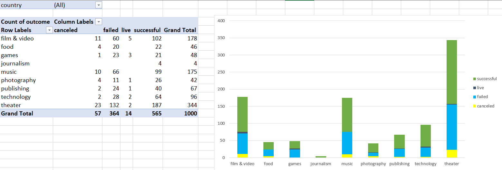
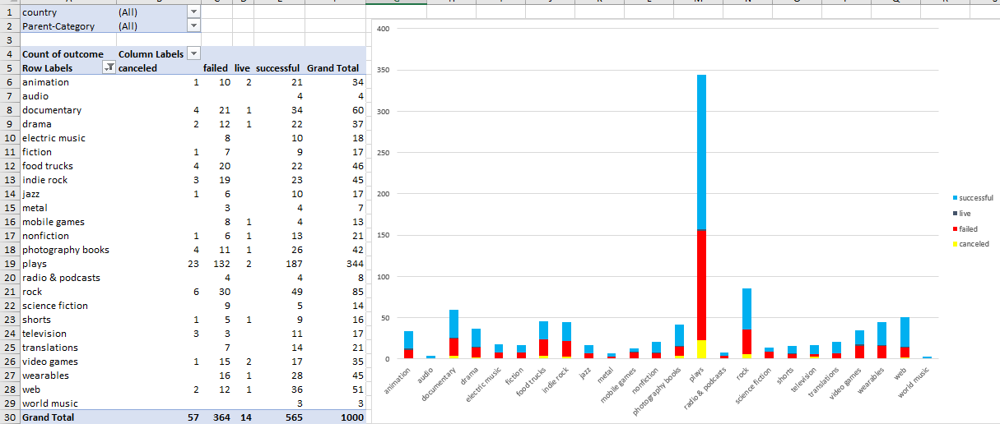
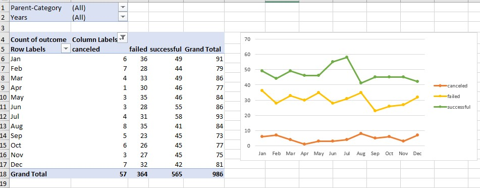

# excel-challenge
## Background
Crowdfunding platforms like Kickstarter and Indiegogo have been growing in success and popularity since the late 2000s. From independent content creators to famous celebrities, more and more people are using crowdunding to launch new products and generate buzz, but not every project has found success.
To receive funding, the project must meet or exceed an initial goal, so many organizations dedicate condiderable resources looking through this Challenge, I was asked to organize and analyze a database of 1,000 sample projects to uncover any hidden trends.

## Procedure:

Using the Excel workbook in my .zip file, modify and analyze the sample-project data and try to uncover market trends.
* Data for this dataset was generated by edX Boot Camps LLC, and is intended for educaitonal purpose only.
* Use conditional formatting to fill each cell in the `outcome` column with a different color, depending on whether the associated campaign was successful, failed, canceled, or is currently live.
  * Create a new column called `Percent Funded` that uses a formula to find how much money a campaing made relative to its initial funding goal.
* Use conditional formatting to fill each cell in the `Percent Funded` column according to a three-color scale. The scale should start at 0 with a dark shade of red, and it should transition to green at 100 and blue at 200.
  * Create a mew column called `Average donationo` that uses a formula to find how much each project backer paid on average.
  * Create two new columns, one called `Parent Category` and another called `Sub-Category`, that use formulas to split the `Category and Sub-Category` column into the two new, separate columns:

    

  * Create a new sheet with a pivot table that analyses my initial worksheet to count how many campaigns were successful, failed, canceled, or are currently live per category.

* Create a stacked-column pivot chart that can be filtered by country based on the table that you created.
  
  

* Create a new sheet with a pivot table that analyzes your initial sheet to count how many campaigns were successful, failed, or canceled, or are currently live per sub-category.
* Create a stacked-column pivot chart that can be filtered by country and parent category based on the table that you created.
* The dates in the `deadline` and `launched_at` columns use Unix timestams.
   * Create a new column named `Date Created Conversion` that will use [this formula](https://www.extendoffice.com/documents/excel/2473-excel-timestamp-to-date.html) to convert the data contained in `launched_at` into Excel's date format.
   * Create a new column named `Date Ended Conversion` that will use [this formula](https://www.extendoffice.com/documents/excel/2473-excel-timestamp-to-date.html) to convert the data contained in 'deadline` into Excel's date format.

     

   * Create a mew sheet with a pivot table that has a column of `outcome`, rows of `Date Created Conversion`, values based on the count of `outcome`, and filters based on `percent category` and `Years`.
   * Now, create a pivot-chart line graph that visualizes this new table.

## Analysis
* Given the provided data, what are three conclusions that we can draw about crowdfunding campaigns?

  * Most of the crowdfunding are successful.
  * Crowdfunding for theater projects, specially plays, is the most successful and had the most amount of successful campaigns; however, if you do the ratio of total campaigns and how many failed, it also has the highest percentage of failures.
  * About 43% failed to meet their goal amount for crowdfunding, and about 57% met or exceeded their goal of crowdfundind.
  * Those who had a goal of raising $50,000 or more had the lowest percent of being successful.
  

* What are some limitations of this dataset?
   * Some limitations on this data include the reason why some crowdfunding campaigns cancelled or failed. There also could be more specific categories that the sub-categories listed. For instance, food trucks is a sub-category. But what types of food trucks were successful vs.failed? Does this play inot the failure to raise money?

* What are some other possible tables and/or graphs that we could create, and what additional value would they provide?

  * Create a pivot table to reflect by category, and did the time they launched to the deadline, play a factor in if crowdfunding was more successful or not? Did projects with a short deadline fail more?
  * What was the average time from launch to deadline by category? This could be useful for people looking to crowdfund to help manage expectations.
  * What was the average financial goal, per category and sub-category, to give perspective to those thinking about starting a crowdfunding campaign?
 
## Crowdfunding Goal Analysis:
     
     

     
     
   
   
