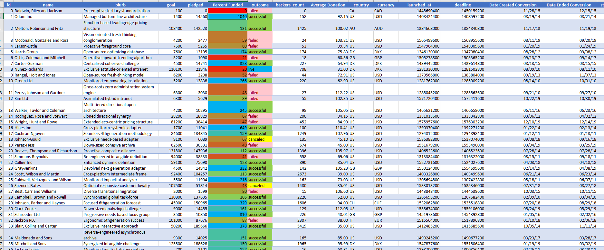

# excel-challenge
## Background
Crowdfunding platforms like Kickstarter and Indiegogo have been growing in success and popularity since the late 2000s. From independent content creators to famous celebrities, more and more people are using crowdunding to launch new products and generate buzz, but not every project has found success.
To receive funding, the project must meet or exceed an initial goal, so many organizations dedicate condiderable resources looking through this Challenge, I was asked to organize and analyze a database of 1,000 sample projects to uncover any hidden trends.

## Procedure:

Using the Excel workbook in my .zip file, modify and analyze the sample-project data and try to uncover market trends.
* Data for this dataset was generated by edX Boot Camps LLC, and is intended for educaitonal purpose only.
* Use conditional formatting to fill each cell in the `outcome` column with a different color, depending on whether the associated campaign was successful, failed, canceled, or is currently live.
  * Create a new column called `Percent Funded` that uses a formula to find how much money a campaing made relative to its initial funding goal.
